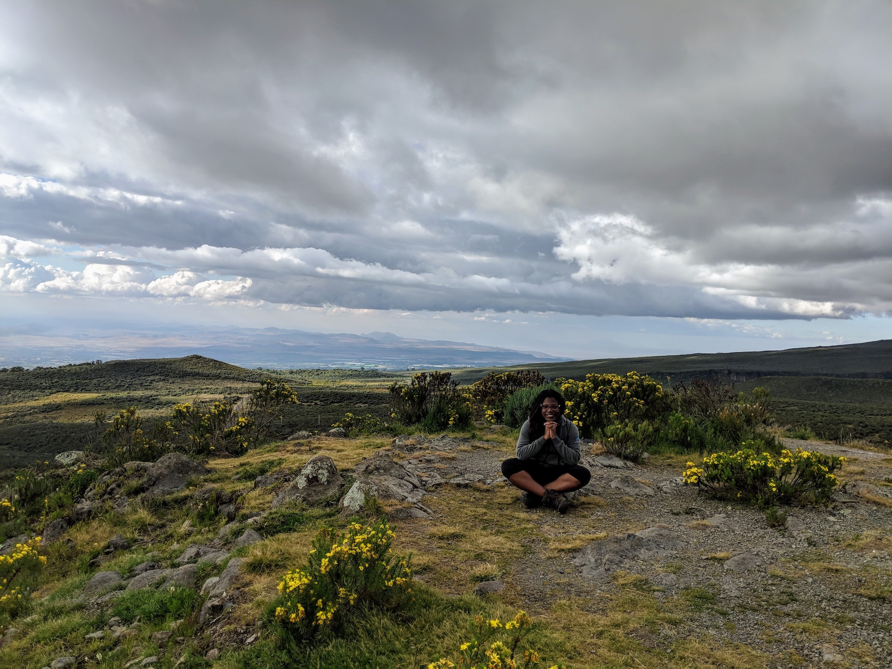

## Well, hello there 👋🏾

Moyinoluwa is a Software Developer currently focused on building for the Android Platform. She loves learning about new technologies and writing about them. She currently works as an Android Developer at Zola Electric and before then, she was an Android Developer at Swifta Systems and Services. She studied Computer Science with Mathematics at Obafemi Awolowo University.

She is very involved with the developer community. She managed the Google Developers Group in her university (GDG OAU) for 3 years and she was a co-organizer for the Google Developers Group in Lagos (GDG Lagos) for almost four years.

While she’s not doing any of these things you’ll probably find her with her nose in a good book, speaking at a developer event, learning German or trying to beat her personal best for a marathon.
