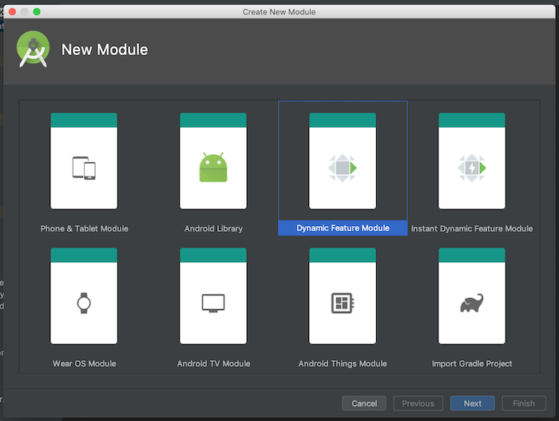
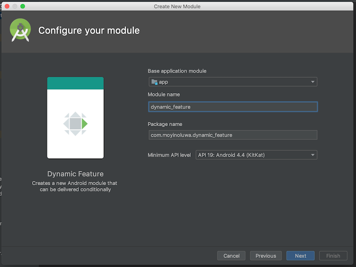
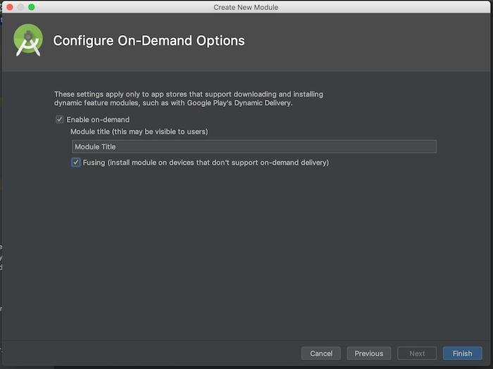
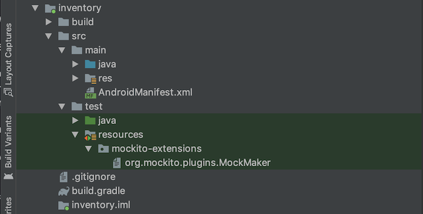
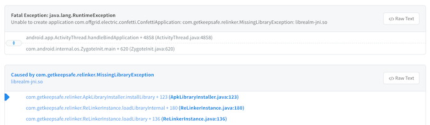

# Dynamic Feature Modules 101



At Zola Electric, we have started the process of splitting our app into dynamic features. As a result of this, we’ve been forced to have serious conversations about the structure of our app’s code and question a lot of our design decisions. 

The first step of the process - determining what features we wanted - was a bit easy for us because the code had already been grouped by features, but we found areas where we needed to rethink some of our implementation. This article ([Dagger Multibinding in Dynamic Feature Modules](http://adavis.info/2019/06/dagger-multibinding-in-dynamic-feature-modules.html)) by [Annyce](https://twitter.com/brwngrldev) explains one of such areas, where we had to update our process of handling Multibinding with Android Jobs.

I’m going to walk through the steps involved with converting one of the modules and all the pain points experienced. This does not take into account all the decisions we had to make but gives a high level overview of the process for anyone looking to get started.

## Create and configure the module

To get started, right click on the root folder and select `New`, `Module` and then the  `Dynamic Feature Module`  option as displayed above. 

The module needs a name and a package name. Ensure that the base package name is the same as the app's package name.



An optional title may be added to the module. Here, you also determine whether the module should be available on-demand, and whether to install the module on devices without the appropriate support.



A couple of changes are made in the project after the Finish button is clicked and a new package is added to the project’s root file. 

## The `build.gradle` file

A custom `build.gradle` file with a dependency on the selected base application module is created along with the new module. The new module will automatically be added to the existing `settings.gradle` file in the root folder like so `include ':app', ':dynamic_feature'`. The module will also be added to the list of dynamic features in the app level `build.gradle` file.

`dynamicFeatures = [":dynamic_feature"]`

In our app, I updated this build.gradle file to include only the required dependencies for the classes specific to the feature. We have a `.gradle` file in the root project that houses all the dependencies needed for tests and it was imported into the `build.gradle` file.

`apply from: '../core_test_dependencies.gradle'`

## The Layout resources

If the module was given a title when it was created, a `strings.xml` file with that title would have been created  in the `res` folder of the new module. I had to relocate the respective layout files for the feature into the  `res` folder too. 

## The `AndroidManifest.xml` file

An `AndroidManifest.xml` file is generated for the new module, but we had to update it. All the required permissions needed for the feature's functionality were included as usual. We haven’t enabled instant modules or the on demand delivery system yet, so we set those values to false.

```xml
<dist:module
    dist:instant="false"
    dist:onDemand="false"
    dist:title="@string/title_dynamic_feature">
    <dist:fusing dist:include="true" />
</dist:module>
```

I also moved the feature specific `Activities` from the app’s `AndroidManifest.xml` file to the `AndroidManifest.xml` file in the newly created dynamic feature module. Everything remained the same except for the entry activity into that module which was called from the App module. Here, we had to create an activity with an intent filter.

```xml
<activity
    android:name=".DynamicFeatureActivity">
    <intent-filter>
        <action android:name="android.intent.action.VIEW" />
    </intent-filter>
</activity>
```

## The Classes

I moved the related classes for the feature from the app module to the feature module. Since our app already followed a convention which we used for the other dynamic feature modules, all I had to do was ensure that this module conformed to it. 

We had to decide what classes to leave in the app module and what to move over. For example, we left all the repositories in the app module because before this, we had already split the database into its own feature module and only the app module depended on it. We also left the associated dagger module class, the events class and a couple of other helper classes in the app module.

## The Unit Tests

We migrated the unit tests and everything ran out of the box, except for a few snags. The first thing to note is that we needed to include a `resources` folder in the test package where we added the `MockMaker` file because this ensures that static classes can still be mocked. Some tests will fail if this is not done. 



There was also [this issue](https://issuetracker.google.com/issues/123441249) where JVM unit tests in the dynamic feature module were failing at runtime with a `NoClassDefFoundError` when run from the terminal, but they passed when run directly in Android Studio.

## The Distribution

Our app is now distributed via `bundles` on Google Play instead of `.apk` files as is required of apps with dynamic feature modules, and we're reaping the benefits already as the app size is already so much smaller. However, because of the regions we build for, we found that sometimes to save data costs the app files were distributed manually among our users and this led to crashes. This would have worked fine with the `.apk` files, but since bundles strip out all the unused resources before creating a device specific apk file, it means a different device would not have all the required resources needed to run the app.



We also needed to update our CI configuration to generate universal and Armeabi apk files needed for QA testing.

## What’s next? - Instrumentation tests?

We’re currently working on creating a shared test module that will host all the instrumentation tests. To achieve this, we needed to extract a new core feature module from the base app module. This will act as the new base module and depend only on the database module. The app module and the shared test module will depend on the code module. We went through each file trying to determine if it should be migrated to the core module or remain in the app module. 

## Final thoughts

This is a lot of work, the kind that's usually very important but not urgent. In the short term, we have to explain to the rest of the team that we were actually hard at work even though there's no visible change in the app. In the long term however, we know that this is a huge step in the right direction as it is giving us the rare opportunity to go through our entire codebase and clean up legacy code.

We're grateful to have resources from the community to guide us in the right direction - the [Plaid app](https://github.com/android/plaid) and articles written by the Android Dev Rel team and other members of the community.

Do you have any comments or suggestions? [Please reach out on Twitter](https://twitter.com/moyheen).
