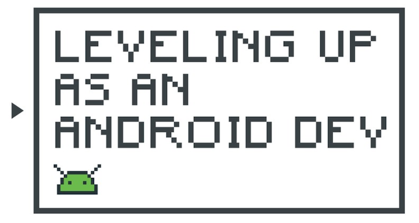
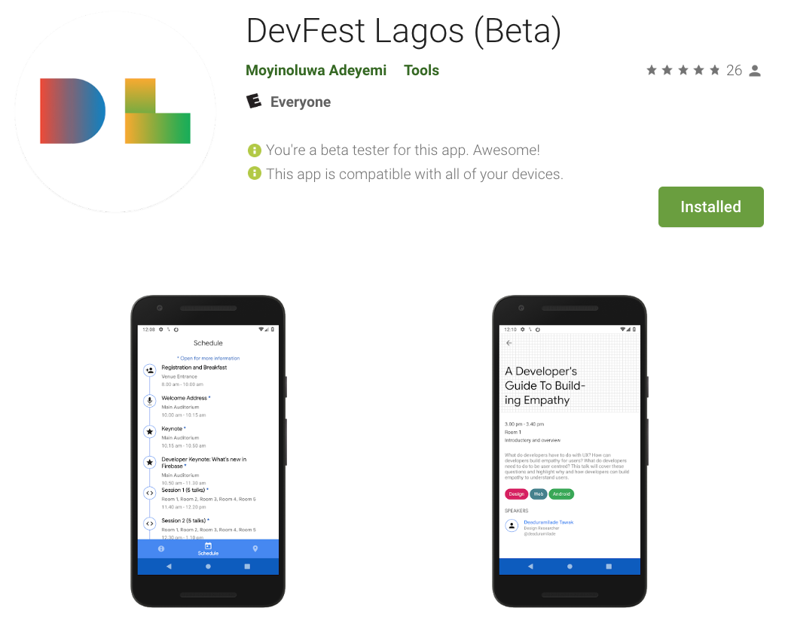
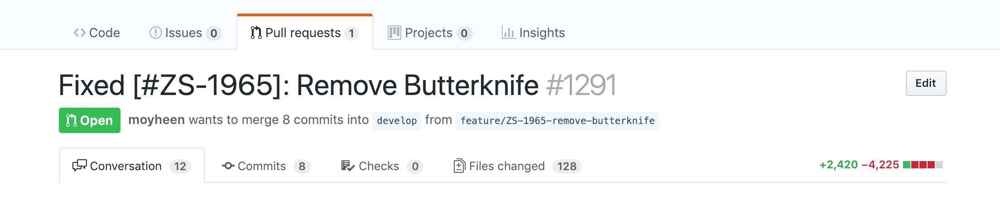

## Leveling Up as an Android Dev (Part 1)
##### April 23, 2019

Chances are you were already a Software Engineer before switching to Android Development. You might also have learnt your first line of Kotlin solely in the bid to become an Android Developer. Regardless of how you started developing for Android, at some point, you'll need to start thinking about advancing to the next stage in your career.

In this article, you'll see the evolution of an Android developer - from Junior, to Intermediate, to Senior and then to Team Lead and beyond. You will learn about what to expect at each stage and gain more insight into how to level up to the next stage.

[Continue Reading](./leveling-up-as-an-android-dev.html)

## Behind The Scenes: DevFest Lagos app
##### Feb 27, 2019

DevFests are annual developer conferences organized by Google Developer Groups (GDGs) around the world. As a co-organizer for GDG Lagos, I worked with three organizers and other amazing volunteers to organize DevFest Lagos in November last year where we hosted 2000 people to a full day of technical talks from live and remote speakers.

[Continue Reading](https://medium.com/@moyinoluwa/behind-the-scenes-devfest-lagos-app-a330002ecc60)

* * *

## Migrating to Kotlin Android Extensions
##### Jan 28, 2019

At Zola Electric, we recently migrated completely off ButterKnife to Kotlin Android Extensions and this article shows the common use-cases we had.

[Continue Reading](https://tech.offgrid-electric.com/migrating-to-kotlin-android-extensions-3af7086a1285)

* * *

## Better than the whiteboard?
##### Nov 15, 2018

There is no one way to conduct a technical interview. People have often used the dreaded whiteboard interviews, take-home coding assignments and even reviewed existing code on Github. There is a lot of backlash against the whiteboard coding interview, understandably so, as that rarely portrays the day-to-day responsibility of the applicant.

[Continue Reading](https://tech.offgrid-electric.com/better-than-the-whiteboard-d2936a59c51d)

* * *

## Creating reusable AlertDialogs with Custom Views in Anko
##### Apr 30, 2018

One of the features Anko is most notable for is simplifying the process of creating layouts programmatically. Anko also offers some variations of some views such as the AlertDialog. The `indeterminateProgressDialog()` displays an AlertDialog with a progress dialog while a `selector()` displays an AlertDialog with a list of text items. Even with all these, sometimes we still need to create dialogs with custom views, and we might need to use those dialogs in multiple screens in our app.

[Continue Reading](https://medium.com/@moyinoluwa/creating-reusable-alertdialogs-with-custom-views-in-anko-539e26d0456d)

* * *

## No Nougat, don’t do that: Winter is Coming ❄️
##### Mar 30, 2018

We’ve been on the journey to upgrade our Android app, ZOLA, to Android O and we’ve finally made it to Android N. Thankfully, we have one more API level to go. We were making this journey all the way from API Level 23.

[Continue Reading](https://tech.offgrid-electric.com/no-nougat-dont-do-that-winter-is-coming-%EF%B8%8F-d1b863706656)

* * *

## Adaptive Icons: Winter is Coming ❄️
##### Jan 30, 2018

We might all have heard about the impending day of judgement, when new and existing Android apps will be required to target API level 26 or higher. While there are some shiny new developer things in Android O — downloadable fonts, adaptive icons etc., there are also some not so shiny things.

[Continue Reading](https://tech.offgrid-electric.com/adaptive-icons-winter-is-coming-%EF%B8%8F-d5e48a70b54b)

* * *

## Book Review: “Remote: Office Not Required”
##### Nov 30, 2017

I recently read Remote: Office Not Required by Jason Fried and David Heinemeier Hansson. I thought it’d be great to see if I was working remotely the right way and pick up tips to improve if I wasn’t. I’ll be sharing a few thoughts from the book in this article. The two most important things which stood out to me and constantly reoccurred throughout all the chapters, sometimes indirectly, were trust and communication.

Our entire software team is structured around these as we don’t have constant remote surveillance. Everyone trusts the other to show up everyday and pick up the phone.

[Continue Reading](https://tech.offgrid-electric.com/book-review-remote-office-not-required-e75e19c68529)

* * *
