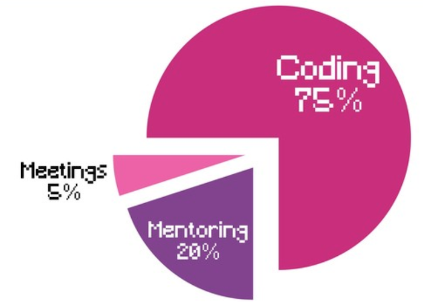
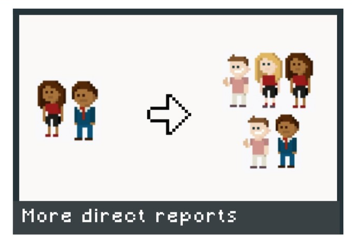

# Leveling Up as an Android Dev (Part 2)

Here's the second (and last) article in the series of Leveling Up as an Android Dev. This article covers more about the other levels, what to expect and stories from experts in the Android Dev community. The first article can be found [here](./leveling-up-as-an-android-dev.html) and the slides for the talk can be found [here](https://speakerdeck.com/moyheen/leveling-up-as-an-android-dev).

## Lead Android Dev

A team lead is usually the most senior developer on the team and we're going to see how that applies to Android Development. While a Senior Android developer is usually focused on getting in quality code on time, a Lead Android Developer is now focused on getting a team of developers to check in quality code on time. They should be very familiar with the code base and contribute regularly to it. They are responsible for high level architectural decisions. They should understand the business problem, so they can have more impact on what the application does and how it will work. They should also empower their colleagues and mentor other developers on the team. They should be great communicators who are capable of leaving constructive feedback on technical work with empathy.

## Annyce's Story

I spoke with Annyce Davis, a former Android Team Lead and she has this to say:

> As a Tech Lead, I spent the majority of my time coding. I was actively developing features for our primary mobile application. The rest of the time was spent mostly mentoring and pair programming with more junior developers. I attended meetings that focused on technical capabilities of the application, timelines for delivering specific features, and normal Agile team meetings.
>
> My time was divided like this:

## Engineering Manager

At this point you can decide to venture into management or remain an Individual Contributor, as a Senior Engineer. The book - The Manager's Path by Camille Fournier highlights all to expect from an Engineering Management position. It is platform agnostic and focused on a general Engineering path but it has a lot of useful information that can be applied to Android Development. Transitioning from an Android Tech Lead to an Engineering Manager requires a lot of support and resources from the company.

However, you can also decide to become an Individual Contributor after spending some time in management.

## Annyce's Story

I spoke with Annyce again, and she had something to chip in here too.

> As an Engineering Manager, my time is more fractured. Unlike a Tech Lead, I spend much less time developing features for our applications. Getting used to this shift has honestly been a bit emotional. I've needed to learn a new way to feel accomplished at the end of the day.
>
> Now my time is divided like this:

* Coding: 30%
* Mentoring: 40%
* Meetings: 20%
* Recruiting: 10%

> Keeping a Weekly Checklist has helped me to avoid feeling overwhelmed by the increase in responsibilities. It also gives me a sense of satisfaction when I check in on Saturday and see that everything has been accomplished.

> The majority of my time is now spent mentoring other developers and attending meetings. I went from having two direct reports to five. Previously, as a Tech Lead, I focused my time on helping the more junior Android developers level up. I shared tips for increasing their productivity in the IDE, showed them how to debug issues more effectively, asked questions to challenge the way they approached developing new features. But this was all focused on Android development where I was the expert.

> However, I now manage Quality Assurance Engineers and Ruby Developers. They're the experts in their domain, not me. I had to approach mentorship from a different angle. I now focus on how I can help unblock them, provide connections to other people in the organization, share career development advice, and more. I also spend time learning about their particular technical domain so that I can relate better to issues that they bring up. I took a course on the fundamentals of Quality Assurance and saw immediate ways that I could use the information to assist the QA Engineers on my team.

## Other Stories

So far, I've only written about the path to leveling up as an in house Android Developer. What happens in the case of independent developers and freelancers, or developers working at a software development agency? I spoke with two other experts in the Android Community and they had this to say.

## Chiuki's perspective

Chiuki is an independent Android Developer, Google Developer Expert and leader in the Android community. She says she hasn't gained any new titles since she became an independent developer, but she gets to develop herself in more dimensions, rather than the usual linear progression associated with working for companies. In answering the question about the best time to become an indie dev; i.e. whether to work at a company first or if it can be the first job a developer has, she thinks most indies who jump in without getting a traditional job do it because they have no choice. Things usually work out but she thinks it takes a lot of initiative and can be difficult without other experience.

## Rebecca's story - Mobile Engineering Manager at Software Development Agency back to Individual Contributor

Rebecca  worked at a software development agency where she grew from Intermediate to Senior Android Developer. At the time, she was working directly with a client through her agency and she was (and still is) actively contributing to the Android community by writing articles and releasing open source projects. These earned her the Android Google Developer Expert title and she was the first woman from Africa to achieve that.

She then stopped work with the client company, returned to her company and was promoted to a Mobile Engineering Manager. The company being an agency meant there was no in - house team and her direct reports were all with different client companies.

In her new role, her responsibilities changed a bit and she was now responsible for:

* Recruitment - which came with lots of interviewing

* Managing new graduates under the graduate management program, with a new batch every six months. There, the curriculum she drew out for beginner Android developers was used for training the graduates. The curriculum started with beginner topics like the basics of version control with Git and then graduated to more complex topics like architecture.

* Writing reviews for her direct reports which was a bit tricky since they were spread out in different client companies and didn't work for the agency directly.

She later decided to make the switch back to become an independent contributor at a product company.

## Conclusion

In this article series, I've attempted to highlight the progression paths in Android development from beginner up until management and back to individual contributor for anyone who wants that. While I acknowledge that this might not hold true for everyone, I've tried to show the shift in responsibilities that comes with each stage and linked to resources I found helpful. I also realize that this might have been a lot to absorb, but I think the most important thing is to accept that this is a journey and enjoy the process every step of the way.
