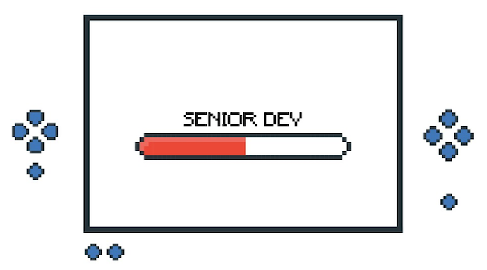

# Leveling Up as an Android Dev 

Chances are you were already a Software Engineer before switching to Android Development. You might also have learnt your first line of Kotlin solely in the bid to become an Android Developer. Regardless of how you started developing for Android, at some point, you'll need to start thinking about advancing to the next stage in your career.

In this article, you'll see the evolution of an Android developer - from Junior, to Intermediate, to Senior and then to Team Lead and beyond. You will learn about what to expect at each stage and gain more insight into how to level up to the next stage.

## New Android Dev  -  no programming experience

We're starting from ground 0. There are two things to learn here; how to code, and how to code for Android. And both of them are usually done at the same time. This involves learning a programming language (Kotlin)'s syntax and paradigms. It also involves getting a feel for developing for the Android platform. This is the point where Android Studio is installed for the first time and you'll have to learn about building layouts with xml, displaying text in a TextView and making a button work.

I've gotten a couple of requests for resources for people at this stage and those I've found that were created specifically for people at this level are the Android Basics courses on Udacity. There are some free and paid content, and usually I'd go through the free content to determine if it works for me enough to pay for it.

## New Android Dev  -  previous programming experience

If you're new to the Android platform and have some experience with programming even if it's in another language or for another platform, there's a bit of a leverage because you already have a feel for how programming works. For example, if you are an iOS developer switching over to Android development, there's already a lot of similarity between Swift and Kotlin. You know to look out for app architecture, you know to write unit and integration tests and even though you might have no experience with the Play Store, you will already have some expectations on how to publish your app.

The Android Basics courses on Udacity also come in handy here. There's a [page on the Android Developer website](https://developer.android.com/kotlin/resources) dedicated to all the resources needed to learn Kotlin.

## My Story

I  started coding in university, after a couple of friends showed me how to build J2ME apps for feature phones. I remember not knowing what I was doing while using the drag and drop feature in Netbeans to create my app's UI. This was way before I knew what Object Oriented programming was and all I had was one massive class with about #10,000 lines of code in it. All that mattered to me then was that it worked. 

I got introduced to Android Development soon enough and because I was mostly self-taught, I had to be in charge of how I learned. I had no directed learning curriculum for Android and it was difficult to determine how to effectively structure my learning. I ended up consuming as many articles and posts I could find in random order because I didn't know what was important and what was not. The official Android Documentation helped me a lot and thankfully, we have a really active Android Developer community so there was almost always an article or Stack Overflow answer to help out.

## New Android Dev to Intermediate Android Dev

It takes time to get really good at things and this applies to Android Development as well. A developer looking to step up at this point should be comfortable enough with the Android platform and understand Android fundamentals. They should be more familiar with Kotlin or Java and should be able to build an app that fetches data from a network and saves it to a database. They should be able to work on new features in an already existing codebase and also find and fix bugs. They should be able to have conversations about App architecture and Architecture components. Now is also a good point to start exploring testing and applying the best practices of Kotlin to your codebase. 

I think it's worth noting that you might have already encountered issues that made you want to tear your hair out. It's fine, it happens to us all. What you do after that is more important though. Since you'll most likely have benefitted a lot from the community to get to this stage, it'll be great to have contribution from you on how you resolved issues or even generally on any new libraries you tried out. Here, it's very easy to fall into the trap of thinking you're not good enough yet and waiting until you feel good enough to write, but the fact is that there's always someone new coming into Android Development and that person might be saved a few hours of frustration by your article. Also think of it as documenting this problem for future you, in case you run into it again and can't remember how to resolve it.

## My story

A big break came for me when I enrolled in a Developing Android Apps course. For the first time in my journey to become an Android developer, I had access to a planned and well thought out curriculum. This was at the time when the course was just picking up steam, and enrolling was enough to get me a feature in [Sebastian Thrun's (Udacity's CEO) Google I/O talk - Democratizing Education](https://youtu.be/898S7o9UnPA?t=1577) in 2015 where I first learnt about the Android Nanodegree which I later enrolled for and completed. I happened to attend I/O that year and I met up with him after his talk where he said I would have been on stage with him if he knew I was in the audience.

I used to think I could get by with learning only from articles, but I tried Massive Open Online Courses (MOOCs) and they surprisingly worked for me. I learnt then never dismiss a new learning approach without trying it first. I built a lot of small apps in that period, both alone and by working with others.

## Intermediate to Senior Android Dev

I never let myself get too comfortable in one position before asking questions about how to get better and what I need to do to get to the next stage. A lot of Android Devs I know have usually had to switch jobs to get a higher title because there's usually no structure for that at their current companies. I did the same, but I landed at the same intermediate role I had at my previous company. As is not uncommon to me, after I had settled in, I started asking questions about what my performance was like, if there was a next level and how I could get there.
 
 I worked with my manager, or rather, my manager worked with me to draw up a list of items. To my surprise, only two of those items were about writing code. I had come all this way, read all those articles, watched all those videos, built all those side projects only to learn that that was just a fraction of what was coming next. 🤯
 
 Here's the list she came up with:
 
*   Assist with developing specs for tickets
*   Understands how to debug/integrate with backend API
*   Collaborate with stakeholders
*   Works well with designer/PM/QA
*   Knows how to work with/debug CI system
*   Develops maintainable/reusable code
*   Familiarity with multiple open-source solutions for common Android tasks
*   Ability to clearly document architecture and processes
*   Can communicate with non-tech business stakeholders
*   Understands the importance of code quality and writing tests
*   Can effectively teach/mentor others
*   Takes ownership of career

## My story
I worked towards it and after six months I was feeling pretty good about my performance and asked for an evaluation during one of my 1–1s with her. We checked each item together and I scored myself and she also scored me. It turns out I had improved, but I still desperately needed work in other areas. Being not one to give up on me, we decided to give it some more time. What that meant for her was that if she identified opportunities to make me fulfill some of those tasks she handed those responsibilities  over to me and started stepping back more. For instance, I started handling bi-weekly demoes to our stakeholders. This was really important for visibility for me because I was a remote employee tucked somewhere in Lagos and the users of our app were in other parts of Africa so the stakeholders usually didn't have to interact with me on a daily basis. This was a good avenue to talk about the features I had implemented and get feedback directly from the people making business decisions. I started handling the release  -  updating the strings from our translation tool, creating test builds for QA, fixing any bugs found from regression tests, uploading to Google Play after the all clear had been given, using the monitoring tools  -  Crashlytics and Mixpanel  -  to check for usage stats, creating a hotfix release if necessary and completing the rollout. I also started taking an active role in interviewing and onboarding potential team members and I was responsible for mentoring the junior developer on the team.

I went back after another six months and it was very obvious that I was nailing it! I'm really grateful to my manager for working on this with me, identifying opportunities for me to grow and shine and letting me handle more responsibility.

## Was it easy?

Balancing everything was difficult for me at first. I like to be super focused on one task and get it done. With this update, people came tugging in all directions. As more people came to the realization that there was someone else in the company who could answer their Android questions, they came calling. It didn't help matters that we had a distributed team with varying timezones. As much as I didn't want to leave anyone blocked, it was difficult for me to balance everything and still get work done. So I went back for help. "How did you manage to do all these things and still get work done? I love to help, but I'm not getting any work done myself".

And help me, she did. She told me of how she slots her tasks into two hour time blocks. In the morning, she checks mails and replies to any pending questions from the day before, reviews any PRs and any other tasks. Next, she focuses on coding for two hours without any interruptions. After that focus period, she reviews any new PRs and answers any queries for one hour. She continues in this cycle for most of the day unless she has meetings. I tried it and it worked for me. This led me to leaving PRs waiting for most of the day, to getting reviewing them in about two hours.

This advice actually corresponds with the one in a chapter - Be responsive and productive - of [The Senior Software Engineer](https://www.amazon.com/Senior-Software-Engineer-Practices-Effective/dp/0990702804/ref=sr_1_1?keywords=senior+software+engineer&qid=1556017163&s=gateway&sr=8-1) book written by David Copeland. There, David talks about being responsive without sacrificing productivity. He recommends pro-actively scheduling interruptions and has research to back that up. His advice is to ensure that work is structured in such a way that it affords many good breaking points, and to create a reasonable schedule for checking email, instant messages, reviewing code and other interruptions.

In the [next article](./leveling-up-as-an-android-dev-part-two.html), I'll be sharing more about the other levels, what to expect and stories from experts in the Android Dev community.
