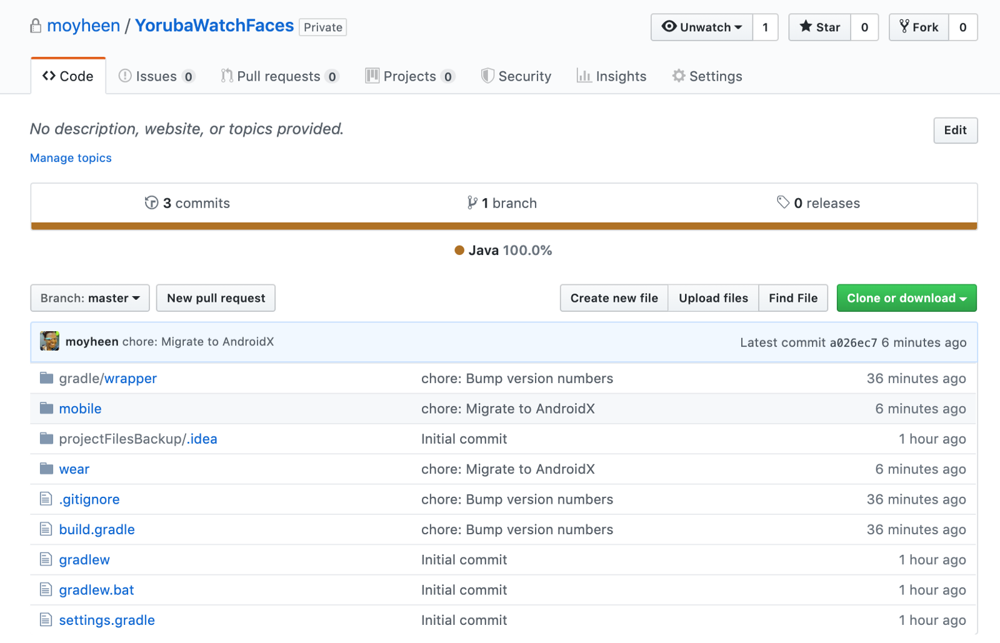

# Project Phoenix

After a long hiatus, I'm revisiting one of my very very old projects…. the [Yoruba Watch face app](https://play.google.com/store/apps/details?id=com.moyinoluwa.yorubawatchfaces) which is actually a watch face *and* a mobile app with a home screen widget.

This app and I have come a long way. It started as a random Friday evening passion project (who stays at home to code for fun on Friday evenings? 😭) and it blew up beyond my expectations, including fetching me an interview on BBC.

<iframe width="400" height="500" frameborder="0" src="https://www.bbc.com/pidgin/media-42999774/embed"></iframe>

The app was last updated in 2016, and boy have I learnt a ton since then! The Android Development landscape has also changed radically, with Kotlin announced as Google's preferred language for Android app development and the release of the Android Jetpack Libraries.

I've decided to update the project to reflect what Android Development in this day looks like. It's only been three years but that's a century in the Android world. I'll be bumping version numbers, migrating to Kotlin and Android X, architecting and modularizing, adding a couple of libraries as I deem fit, updating the Wear app to 2.0, probably removing the home screen widget and adding new features. Design sprints, anyone?

I'll share any learnings in the process and might eventually decide to make it open-source. I don't fully know where this is headed yet, but I'm excited about my rekindled excitement at coding for fun  -  which is how all this started.

Looking to collaborate with Product Designers to improve the app's look. [Please reach out on Twitter](https://twitter.com/moyheen) if that's you, or if you have feedback or feature suggestions :)
